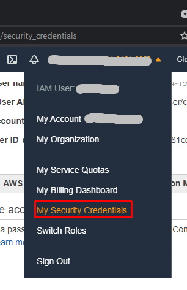

# Create a static web server on Amazon S3

Create and configure a simple static website. We will go through configuring that static website with a custom error page. This will demonstrate how to create a cost-efficient website hosting for sites that consist of files like HTML, CSS, JavaScript, fonts, and images.

## Project Diagram
 

## What is done
The following steps are the ones implemented on Terraform in order to create the environment for the application to execute: 
* Create S3 Bucket
* Enable Static Website Hosting
* Apply Bucket Policy

## How to deploy
Login to your AWS account and get the Credentials and create the EC2's Key Pairs.
Then in the same place as the file 'main.tf':

````
# this will initiate Terraform on your project
terraform init

# this will findout what operations Terraform will perform
terraform plan 

# this will apply what is configure in your project
terraform apply 
````


## Credentials Setup
To find your credentials go to the places shown by the pictures:

 

  

Set credentials on file main.tf and update:

```
provider "aws" {
  region     = "us-west-1"
  access_key = "xxxxxxxxxxxxxx"
  secret_key = "xxxxxxxxxxxxxxxxxxxxxxxxxxxxxx"
}
````


