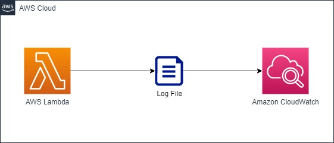
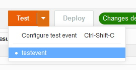
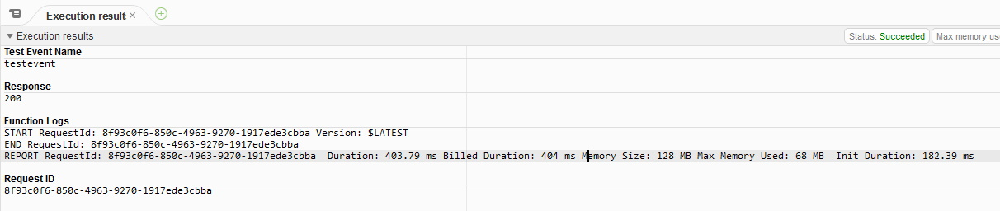

# Create a basic lambda and send logs to Cloudwatch

## Description
In this project it is created a Lambda function that runs code in Javascript that connects to a site and generates logs that are sent to Cloudwatch.


## Diagram


## What is done
* Create a Lambda function
* Create a Javascript file
* Send Logs to Amazon CloudWatch

## How to deploy
Login to your AWS account and get the Credentials.
Then in the same place as the file 'main.tf':

````
# this will initiate Terraform on your project
terraform init

# this will findout what operations Terraform will perform
terraform plan 

# this will apply what is configure in your project
terraform apply 
````


## Credentials Setup
To find your credentials go to the places shown by the pictures:

 

 

Set credentials on file main.tf and update:

```
provider "aws" {
  region     = "us-west-1"
  access_key = "xxxxxxxxxxxxxx"
  secret_key = "xxxxxxxxxxxxxxxxxxxxxxxxxxxxxx"
}
````


## Check Results
1. Open the lambda URLChecker
2. Create test event

3. Run test event

4. Check test event results

5. go to clouwdwatch and view the logs

