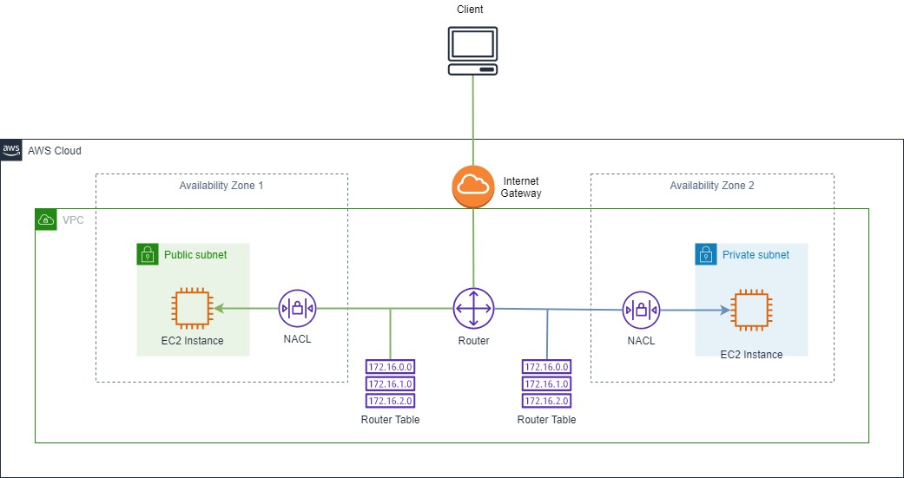

# Create a Basic VPC and Associated Components

## Description
AWS networking consists of multiple components, and understanding the relationship between the networking components is a key part of understanding the overall functionality and capabilities of AWS. It will be created a VPC with an internet gateway, as well as create subnets across multiple Availability Zones.

## Diagram

## Actions
* Create a VPC
* Create a Public and Private Subnet in Different Availability Zones
* Create Two Network Access Control Lists (NACLs), and Associate Each with the Proper Subnet
* Create an Internet Gateway, and Connect It to the VPC
* Create Two Route Tables, and Associate Them with the Correct Subnet