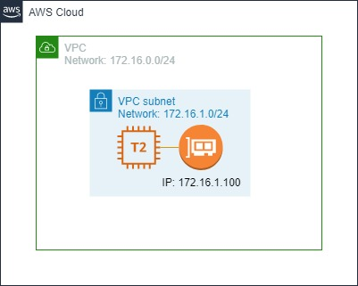

# Create an EC2 instance

## Description
This is about how to select and instanciate an AMI image on EC2

## Diagram

## Actions
* Create a VPC
* Create Subnet
* Create Elastic Network Interface in the subnet
* Define the image
* Associate the image to the subnet and to the Elastic Network Interface

## Components Description
Amazon VPC is the networking layer for Amazon EC2.

The following are the key concepts for VPCs:
* Virtual private cloud (VPC) — A virtual network dedicated to your AWS account.
* Subnet — A range of IP addresses in your VPC.
* Elastic Network Interface -  is a logical networking component in a VPC that represents a virtual network card.
* AMI - An Amazon Machine Image (AMI) provides the information required to launch an instance

## References
[Elastic Network Interfaces](https://docs.aws.amazon.com/AWSEC2/latest/UserGuide/using-eni.html)

[What is Amazon EC2?](https://docs.aws.amazon.com/AWSEC2/latest/UserGuide/concepts.html)

[Amazon Machine Images (AMI)](https://docs.aws.amazon.com/AWSEC2/latest/UserGuide/AMIs.html)