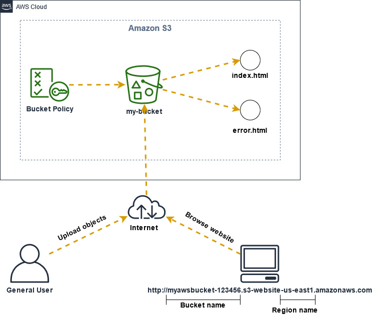
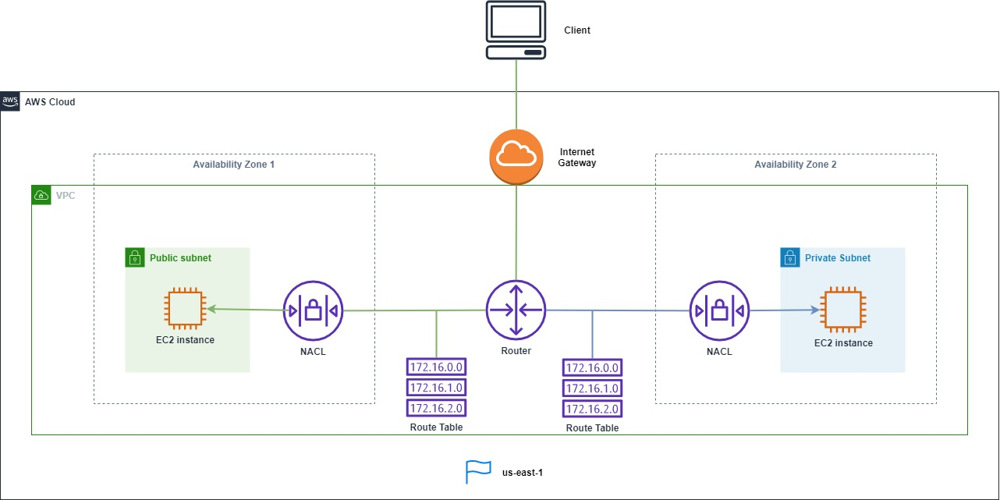

# Terraform Amazon Web Services

This Repository is intended to be a place where one can be introduced to AWS and Terraform.
Terraform is a tool to construct all the artfacts needed in AWS.

## Projects
Here is a short description for all the projects in this repository

### 01. Create a static web server on Amazon S3
Create and configure a simple static website

### 02. Create a basic lambda and send logs to Cloudwatch
Create a lambda that when executed sends logs to Cloudwatch

### 03. Create a VPC and its components
Create and understande the VPC concept and what are its components

### 04. Create a VPC and its components
Create and understande the VPC concept and what are its components

