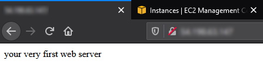
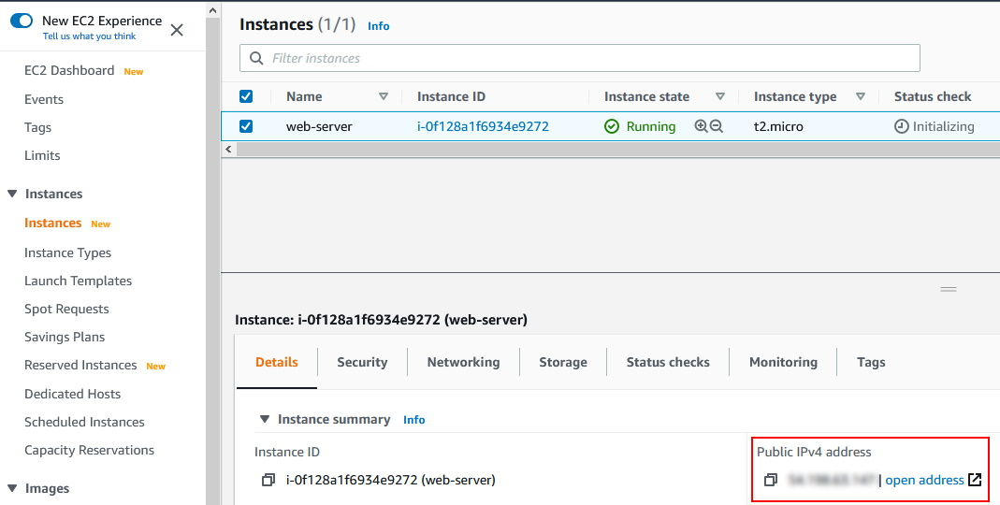
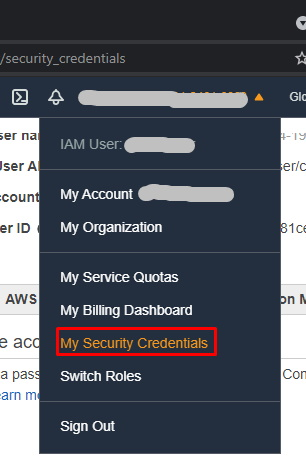
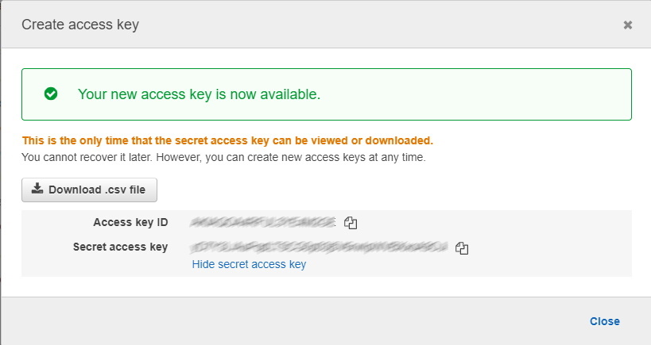
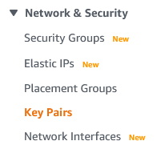
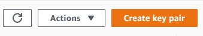
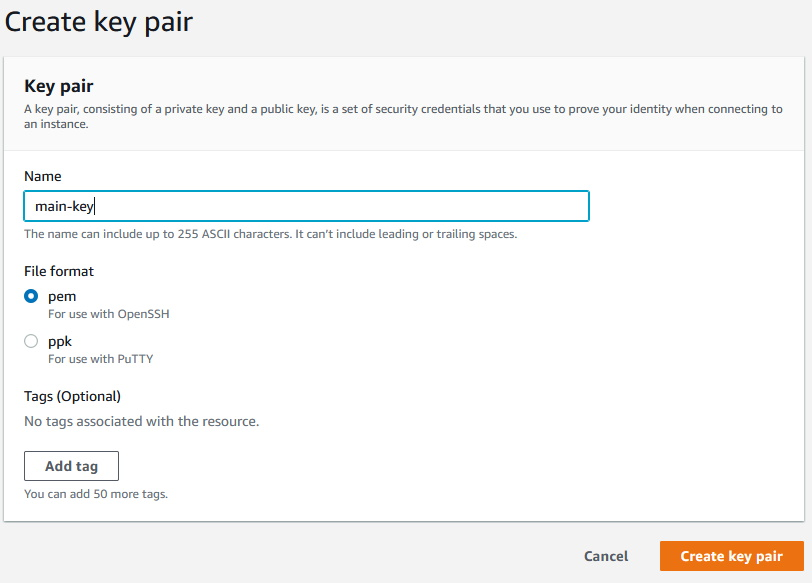

## Introduction
This a small project that intents to introduce to Terraform and Amazon Web Services (AWS).
This project creates a small web server that displays string when connected from Internet.
All AWS artefacts needed are created by Terraform

## Project Diagram
 

## What is done
The following steps are the ones implemented on Terraform in order to create the environment for the application to execute: 

1. Create a VPC
2. Create an Internet Gateway
3. Create a Custom Route Table
4. Create a Subnet
5. Associate subnet with Route Table
6. Create a Security Group to allow port 22,80,443
7. Create a network interface with an IP in the subnet that was created in step 4
8. Assign an elastic IP to the network interface created in step 7
9. Create Ubuntu server and install/enable apache2

## How to deploy
Login to your AWS account and get the Credentials and create the EC2's Key Pairs.
Then in the same place as the file 'main.tf':

````
# this will initiate Terraform on your project
terraform init

# this will findout what operations Terraform will perform
terraform plan 

# this will apply what is configure in your project
terraform apply 
````

If everything went whell you can view the output of the server
 

 To see the output you must get the Public IP of your instance, you can get it at the EC2 instances page and get the 
 

## Credentials Setup
To find your credentials go to the places shown by the pictures:

 

  

Set credentials on file main.tf and update:

```
provider "aws" {
  region     = "us-west-2"
  access_key = "xxxxxxxxxxxxxx"
  secret_key = "xxxxxxxxxxxxxxxxxxxxxxxxxxxxxx"
}
````
## EC2's Key Pairs
* Go to EC2 page
* Click on "Key Pairs" on Network & Security 

* Click on "Create Key Pair" button 
* Fill the form like in the image 


